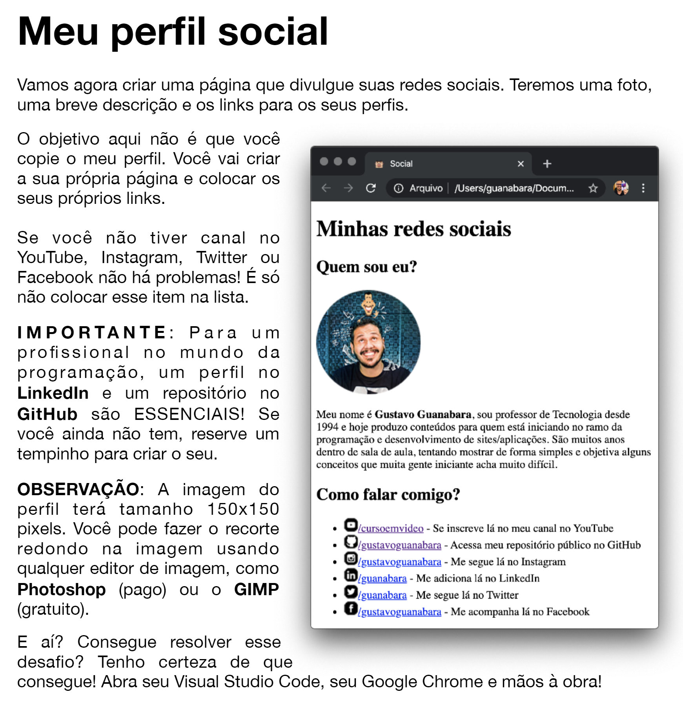

# <b> Desafio 5 do modulo 1 | fazer uma pagina de apresentação </b>

o link do site que eu criei a partir desse desafio vai estar [aqui]()

## Mas qual é o objetivo do desafio? 

---
Como é para fins de estudos, eu decidi me divertir um pouco e utilizar o pouco de css que sei, mudei algumas coisas (dimensões da foto é um pouco maior por exemplo). Ele sempre fala pra brincar e testar coisas novas e foi isso que eu fiz e deu nisso :D

<h2 align="center">
  
</h2>

Desenvolvido com 🧡

