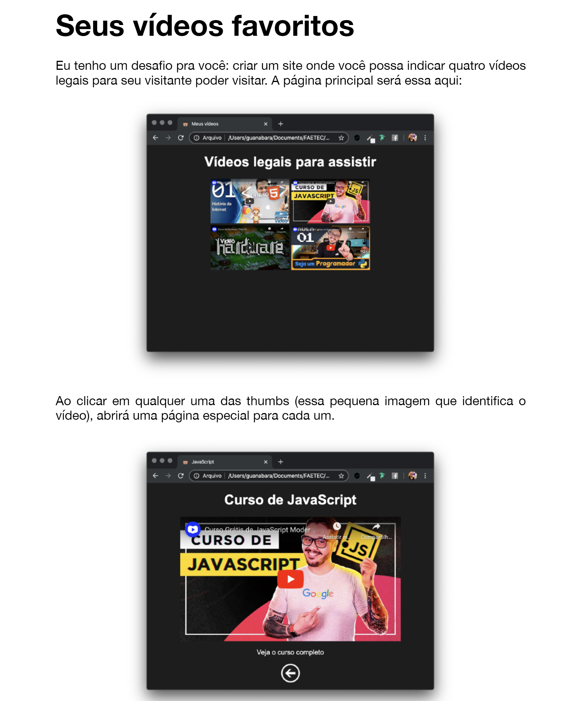
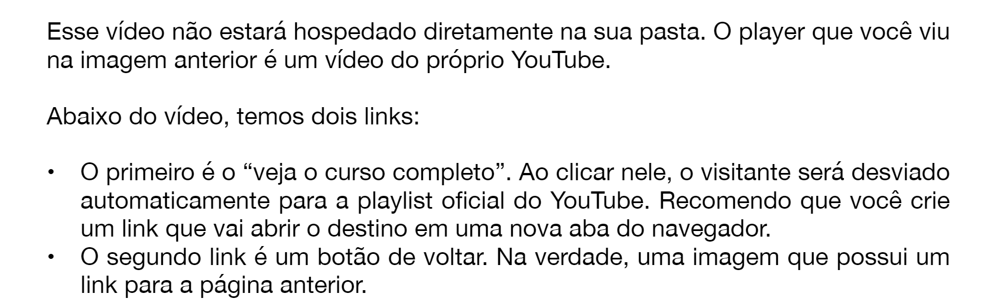

# <b> Desafio 9 do modulo 1 | fazer uma pagina com videos legais </b>

para ver o site que eu criei é apenas [clicar aqui](https://videos-legais.netlify.app/)
 
## Qual é o desafio?

  
  

## Porque o meu ta diferente?
porque ele sempre fala pra gente brincar e deixar a criatividade levar a gente, então eu fiz de gatinhos, uma coisa que gosto muito e amo ver memes. eu tentei usar um pouco de css também porém não soube resolver o problema dos frames separadinhos (no meu pc tava bonitinho e lindo, quando fiz o deploy ele mudou tudo!), mas com o tempo vou aprendendo :3

---

<h2 align="center">
  
</h2>

Desenvolvido com 🧡

